# RSM - Trainee Program - Final Project

## BUILT WITH

### Frontend:
- React
- Axios
- react-pdf
- Ant Design
- Chakra UI
- react-csv
- react-icons
- React Router
- TypeScript
- Vite

### Backend:
- C#
- .Net Core
- Entity Framework
- Redis
- AspNetCoreRateLimit

### Tooling:
- Visual Studio
- Visual Studio Code
- Git
- Docker
- Microsoft SQL Server
- SQL Server Management Studio (SSMS)

## INSTALLATION GUIDE

1. **Clone the repository**
   ```sh
   git clone https://github.com/Marvin-Figueroa/RSMFinalProject.git

2. **Open the project in Visual Studio**

3. **Install Dependencies for Each Project (Backend and Frontend):**

   **Backend (ASP.NET Core):**
   - Navigate to the directory containing the ASP.NET Core project (`RSMFinalProject.Server`).
   - Open a terminal or command prompt in that directory.
   - Run `dotnet restore` command. This will restore the NuGet packages specified in the `*.csproj` file.

   **Frontend (React):**
   - Navigate to the directory containing the React project (`rsmfinalproject.client`).
   - Open a terminal or command prompt in that directory.
   - Run `npm install` command. This will install the Node.js dependencies specified in the `package.json` file.

   - Create a `.env` file in the root of the project and add the following:
     ```env
     VITE_API_BASE_URL=https://localhost:7186/api/v1/sales
     ```
     Don't forget to update the port to match yours.

4. **Make sure you have Microsoft SQL Server running and connected to the AdventureWorks2022 database.**
   - Visit [Microsoft SQL Server Sample Databases](https://learn.microsoft.com/en-us/sql/samples/adventureworks-install-configure?view=sql-server-ver16&tabs=ssms) for instructions.

5. **Create the required stored procedures in the AdventureWorks2022 database.**
   - The installation of SQL Management Studio is recommended to interact with the database.
   - Visit [Download SQL Server Management Studio (SSMS)](https://learn.microsoft.com/es-es/sql/ssms/download-sql-server-management-studio-ssms?view=sql-server-ver16) for download options.

## GetSalesOrderDetails Stored Procedure

```sql
CREATE PROCEDURE GetSalesOrderDetails
    @TerritoryName NVARCHAR(100) = NULL,
    @StartDate DATE = NULL,
    @EndDate DATE = NULL,
    @CustomerName NVARCHAR(100) = NULL,
    @ProductCategoryName NVARCHAR(100) = NULL,
    @ProductSubcategoryName NVARCHAR(100) = NULL,
    @OnlineOrderFlag BIT = NULL,
    @PageNumber INT = 1,
    @PageSize INT = 10,
	@TotalCount INT OUTPUT
AS
BEGIN
    SET NOCOUNT ON;

    IF @StartDate IS NULL
        SELECT @StartDate = MIN(OrderDate) FROM Sales.SalesOrderHeader;

    IF @EndDate IS NULL
        SELECT @EndDate = GETDATE();

	-- GET THE TOTAL COUNT WITHOUT PAGINATION
    
	SELECT @TotalCount = COUNT(*)
    FROM 
        Sales.SalesOrderHeader soh
    JOIN Sales.SalesTerritory st ON soh.TerritoryID = st.TerritoryID
    JOIN Sales.Customer c ON soh.CustomerID = c.CustomerID
    JOIN Person.Person p ON c.PersonID = p.BusinessEntityID
    JOIN Sales.SalesOrderDetail sod ON soh.SalesOrderID = sod.SalesOrderID
    JOIN Production.Product prod ON sod.ProductID = prod.ProductID
    JOIN Production.ProductSubcategory psc ON prod.ProductSubcategoryID = psc.ProductSubcategoryID
    JOIN Production.ProductCategory pc ON psc.ProductCategoryID = pc.ProductCategoryID
    LEFT JOIN Sales.SalesPerson sp ON soh.SalesPersonID = sp.BusinessEntityID
    LEFT JOIN HumanResources.Employee e ON sp.BusinessEntityID = e.BusinessEntityID
    LEFT JOIN Person.Person p2 ON e.BusinessEntityID = p2.BusinessEntityID

    WHERE 
        (@TerritoryName IS NULL OR st.Name = @TerritoryName)
        AND soh.OrderDate BETWEEN @StartDate AND @EndDate
        AND (@CustomerName IS NULL OR CONCAT_WS(' ', p.FirstName, p.LastName) LIKE '%' + @CustomerName + '%')
        AND (@ProductCategoryName IS NULL OR pc.Name = @ProductCategoryName)
        AND (@ProductSubcategoryName IS NULL OR psc.Name = @ProductSubcategoryName)
        AND (@OnlineOrderFlag IS NULL OR soh.OnlineOrderFlag = @OnlineOrderFlag)

	-- GET THE PAGINATED RESULTS

    SELECT 
        soh.SalesOrderID AS OrderID,
        sod.SalesOrderDetailID,
        soh.OrderDate AS Date,
        soh.OnlineOrderFlag AS OnlineOrder,
        st.Name AS Territory,
        CONCAT_WS(' ', p.FirstName, p.LastName) AS CustomerPerson,
        CONCAT_WS(' ', p2.FirstName, p2.LastName) AS Salesperson,
        prod.Name AS Product,
        pc.Name AS Category,
        psc.Name AS Subcategory,
        sod.OrderQty AS Quantity,
        sod.UnitPrice AS UnitPrice,
        sod.LineTotal AS TotalPrice	

    FROM 
        Sales.SalesOrderHeader soh
    JOIN Sales.SalesTerritory st ON soh.TerritoryID = st.TerritoryID
    JOIN Sales.Customer c ON soh.CustomerID = c.CustomerID
    JOIN Person.Person p ON c.PersonID = p.BusinessEntityID
    JOIN Sales.SalesOrderDetail sod ON soh.SalesOrderID = sod.SalesOrderID
    JOIN Production.Product prod ON sod.ProductID = prod.ProductID
    JOIN Production.ProductSubcategory psc ON prod.ProductSubcategoryID = psc.ProductSubcategoryID
    JOIN Production.ProductCategory pc ON psc.ProductCategoryID = pc.ProductCategoryID
    LEFT JOIN Sales.SalesPerson sp ON soh.SalesPersonID = sp.BusinessEntityID
    LEFT JOIN HumanResources.Employee e ON sp.BusinessEntityID = e.BusinessEntityID
    LEFT JOIN Person.Person p2 ON e.BusinessEntityID = p2.BusinessEntityID

    WHERE 
        (@TerritoryName IS NULL OR st.Name = @TerritoryName)
        AND soh.OrderDate BETWEEN @StartDate AND @EndDate
        AND (@CustomerName IS NULL OR CONCAT_WS(' ', p.FirstName, p.LastName) LIKE '%' + @CustomerName + '%')
        AND (@ProductCategoryName IS NULL OR pc.Name = @ProductCategoryName)
        AND (@ProductSubcategoryName IS NULL OR psc.Name = @ProductSubcategoryName)
        AND (@OnlineOrderFlag IS NULL OR soh.OnlineOrderFlag = @OnlineOrderFlag)

    ORDER BY 
        OrderID, 
        OrderDate DESC, 
        Territory, 
        CustomerPerson,
        Salesperson, 
        Product, 
        Category, 
        Subcategory
    OFFSET (@PageNumber - 1) * @PageSize ROWS
    FETCH NEXT @PageSize ROWS ONLY;
END;
```

## GetSalesPerformance Stored Procedure

```sql
CREATE PROCEDURE GetSalesPerformance
   @ProductCategoryName NVARCHAR(100) = NULL,
    @ProductName NVARCHAR(100) = NULL,
    @RegionName NVARCHAR(100) = NULL,
	@PageNumber INT = 1,
    @PageSize INT = 10,
	@TotalCount INT OUTPUT
AS
BEGIN
    SET NOCOUNT ON;

	-- GET THE TOTAL COUNT WITHOUT PAGINATION

    WITH SalesByProductCategory AS
    (
        SELECT
            pc.ProductCategoryID,
            SUM(sod.LineTotal) AS TotalSales
        FROM
            Production.Product p
            JOIN Sales.SalesOrderDetail sod ON sod.ProductID = p.ProductID
            JOIN Sales.SalesOrderHeader soh ON sod.SalesOrderID = soh.SalesOrderID
            JOIN Production.ProductSubcategory psc ON p.ProductSubcategoryID = psc.ProductSubcategoryID
            JOIN Production.ProductCategory pc ON psc.ProductCategoryID = pc.ProductCategoryID
        GROUP BY
            pc.ProductCategoryID
    ),
    SalesByTerritory AS
    (
        SELECT
            st.TerritoryID,
            SUM(sod.LineTotal) AS TotalSalesPerTerritory
        FROM
            Sales.SalesOrderDetail sod
            JOIN Sales.SalesOrderHeader soh ON sod.SalesOrderID = soh.SalesOrderID
            JOIN Sales.SalesTerritory st ON soh.TerritoryID = st.TerritoryID
        GROUP BY
            st.TerritoryID
    ),
    TotalSalesPerCategoryAndRegion AS
    (
        SELECT
            st.TerritoryID,
            pc.ProductCategoryID,
            SUM(sod.LineTotal) AS TotalSalesPerCategoryAndRegion
        FROM
            Sales.SalesOrderDetail sod
            JOIN Sales.SalesOrderHeader soh ON sod.SalesOrderID = soh.SalesOrderID
            JOIN Sales.SalesTerritory st ON soh.TerritoryID = st.TerritoryID
            JOIN Production.Product p ON sod.ProductID = p.ProductID
            JOIN Production.ProductSubcategory psc ON p.ProductSubcategoryID = psc.ProductSubcategoryID
            JOIN Production.ProductCategory pc ON psc.ProductCategoryID = pc.ProductCategoryID
        GROUP BY
            st.TerritoryID, pc.ProductCategoryID
    ), 
    TotalRecords AS
    (
	    SELECT 
		    p.Name AS ProductName,
		    pc.Name AS ProductCategory,
		    st.Name AS Region
	    FROM
		    production.product p
		    JOIN Production.ProductSubcategory psc ON p.ProductSubcategoryID = psc.ProductSubcategoryID
		    JOIN Production.ProductCategory pc ON psc.ProductCategoryID = pc.ProductCategoryID
		    JOIN Sales.SalesOrderDetail sod ON sod.ProductID = p.ProductID
		    JOIN Sales.SalesOrderHeader soh ON sod.SalesOrderID = soh.SalesOrderID
		    JOIN Sales.SalesTerritory st ON soh.TerritoryID = st.TerritoryID
		    JOIN SalesByProductCategory sbpc ON pc.ProductCategoryID = sbpc.ProductCategoryID
		    JOIN SalesByTerritory sbt ON st.TerritoryID = sbt.TerritoryID
		    JOIN TotalSalesPerCategoryAndRegion tspcar ON st.TerritoryID = tspcar.TerritoryID AND pc.ProductCategoryID = tspcar.ProductCategoryID
	    WHERE
            (@ProductCategoryName IS NULL OR pc.Name = @ProductCategoryName) AND
            (@ProductName IS NULL OR p.Name LIKE '%' + @ProductName + '%') AND
            (@RegionName IS NULL OR st.Name = @RegionName)
        GROUP BY
		    p.Name,
	        pc.Name,
		    sod.LineTotal,
		    st.Name
    )

    SELECT @TotalCount = COUNT(*) FROM TotalRecords;

	-- GET THE PAGINATED RESULTS

	WITH SalesByProductCategory AS
    (
        SELECT
            pc.ProductCategoryID,
            SUM(sod.LineTotal) AS TotalSales
        FROM
            Production.Product p
            JOIN Sales.SalesOrderDetail sod ON sod.ProductID = p.ProductID
            JOIN Sales.SalesOrderHeader soh ON sod.SalesOrderID = soh.SalesOrderID
            JOIN Production.ProductSubcategory psc ON p.ProductSubcategoryID = psc.ProductSubcategoryID
            JOIN Production.ProductCategory pc ON psc.ProductCategoryID = pc.ProductCategoryID
        GROUP BY
            pc.ProductCategoryID
    ),
    SalesByTerritory AS
    (
        SELECT
            st.TerritoryID,
            SUM(sod.LineTotal) AS TotalSalesPerTerritory
        FROM
            Sales.SalesOrderDetail sod
            JOIN Sales.SalesOrderHeader soh ON sod.SalesOrderID = soh.SalesOrderID
            JOIN Sales.SalesTerritory st ON soh.TerritoryID = st.TerritoryID
        GROUP BY
            st.TerritoryID
    ),
    TotalSalesPerCategoryAndRegion AS
    (
        SELECT
            st.TerritoryID,
            pc.ProductCategoryID,
            SUM(sod.LineTotal) AS TotalSalesPerCategoryAndRegion
        FROM
            Sales.SalesOrderDetail sod
            JOIN Sales.SalesOrderHeader soh ON sod.SalesOrderID = soh.SalesOrderID
            JOIN Sales.SalesTerritory st ON soh.TerritoryID = st.TerritoryID
            JOIN Production.Product p ON sod.ProductID = p.ProductID
            JOIN Production.ProductSubcategory psc ON p.ProductSubcategoryID = psc.ProductSubcategoryID
            JOIN Production.ProductCategory pc ON psc.ProductCategoryID = pc.ProductCategoryID
        GROUP BY
            st.TerritoryID, pc.ProductCategoryID
    )

    SELECT
		ROW_NUMBER() OVER (ORDER BY (SELECT NULL)) AS Id,
        p.Name AS ProductName,
        pc.Name AS ProductCategory,
        st.Name AS Region,
        sod.LineTotal AS TotalSales,
        CAST(ROUND(sod.LineTotal * 100.0 / sbt.TotalSalesPerTerritory, 2) AS DECIMAL(10, 2)) AS PercentageOfTotalSalesPerRegion,
        CAST(ROUND(sod.LineTotal * 100.0 / tspcar.TotalSalesPerCategoryAndRegion, 2) AS DECIMAL(10, 2)) AS PercentageOfTotalCategorySalesInRegion
    FROM
        Production.Product p
        JOIN Production.ProductSubcategory psc ON p.ProductSubcategoryID = psc.ProductSubcategoryID
        JOIN Production.ProductCategory pc ON psc.ProductCategoryID = pc.ProductCategoryID
        JOIN Sales.SalesOrderDetail sod ON sod.ProductID = p.ProductID
        JOIN Sales.SalesOrderHeader soh ON sod.SalesOrderID = soh.SalesOrderID
        JOIN Sales.SalesTerritory st ON soh.TerritoryID = st.TerritoryID
        JOIN SalesByProductCategory sbpc ON pc.ProductCategoryID = sbpc.ProductCategoryID
        JOIN SalesByTerritory sbt ON st.TerritoryID = sbt.TerritoryID
        JOIN TotalSalesPerCategoryAndRegion tspcar ON st.TerritoryID = tspcar.TerritoryID AND pc.ProductCategoryID = tspcar.ProductCategoryID
	WHERE
        (@ProductCategoryName IS NULL OR pc.Name = @ProductCategoryName) AND
        (@ProductName IS NULL OR p.Name LIKE '%' + @ProductName + '%') AND
        (@RegionName IS NULL OR st.Name = @RegionName)
	GROUP BY
        p.Name,
        pc.Name,
        sod.LineTotal,
        st.Name,
		sbpc.TotalSales,
        sbt.TotalSalesPerTerritory,
        tspcar.TotalSalesPerCategoryAndRegion
    ORDER BY
        PercentageOfTotalCategorySalesInRegion DESC
	OFFSET (@PageNumber - 1) * @PageSize ROWS
    FETCH NEXT @PageSize ROWS ONLY;
END;
```

## Redis Setup

6. **Ensure Redis Database Instance is Running**
   - Install Docker (Visit: [Docker](https://www.docker.com/get-started/))
   - Install Redis Image: `docker run --name my-redis -p 6379:6379 -d redis`
   (Visit: [Redis Docker Hub](https://hub.docker.com/_/redis))
   - Verify that Redis is running: `docker ps` 

7. **Verify App Settings**
   - Make sure the settings in the `appsettings.json` file match the following, or update accordingly:

```json
{
  "Logging": {
    "LogLevel": {
      "Default": "Information",
      "Microsoft.AspNetCore": "Warning"
    }
  },
  "CorsOrigins": [ "https://localhost:5173" ],
  "AllowedHosts": "*",
  "ConnectionStrings": {
    "localServer": "Server=.\\SQLEXPRESS;DataBase=AdventureWorks2022;Trusted_Connection=True;Encrypt=False;TrustServerCertificate=False",
    "redisServer": "localhost:6379"
  }
}
```
 - Modify "localServer", "redisServer", and "CorsOrigins" to match your own configurations.

 ## Running the Project

8. **Run the Project and Have Fun**
   - The server project will start first, followed by the client project, as the server project is configured as the startup project.

9. **Verify Redis Cache**
   - Use redis-cli to check if the requests are getting cached properly:
     ```
     docker exec -it my-redis redis-cli
     ```

10. **Search for Cache Keys**
    - In redis-cli, search for cache keys filtering by their names using a pattern:
      ```
      KEYS SalesDetails:*
      ```
      This will show the keys that start with 'SalesDetails:'.
      ```
      KEYS SalesPerformance:*
      ```
      This will show the keys that start with 'SalesPerformance:'.

11. ## Screenshots

**App - Home Page**
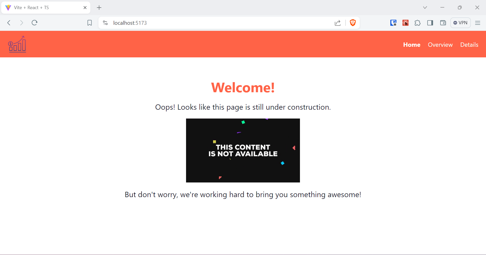

**App - Sales Overview Page**
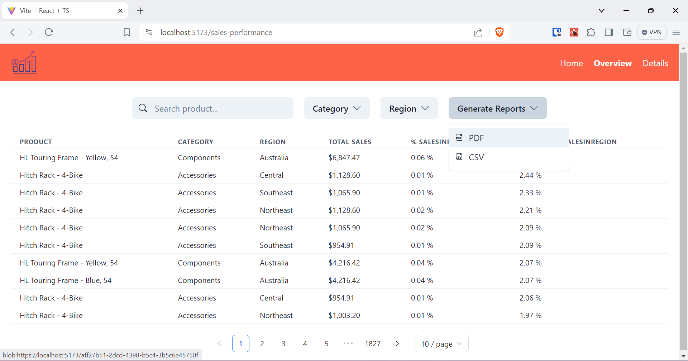

**App - Sales Details Page**
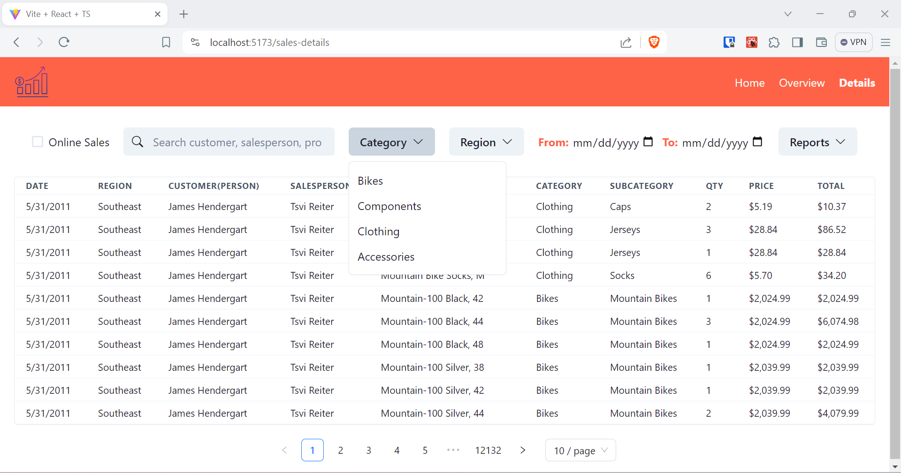

**PDF Generated Report**
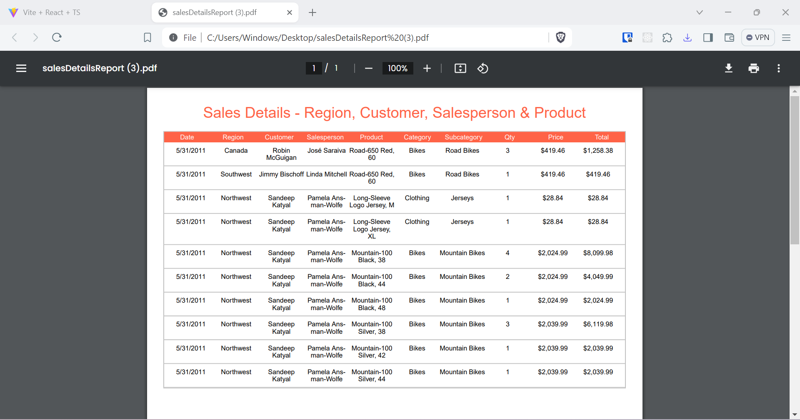

**CSV Generated Report**
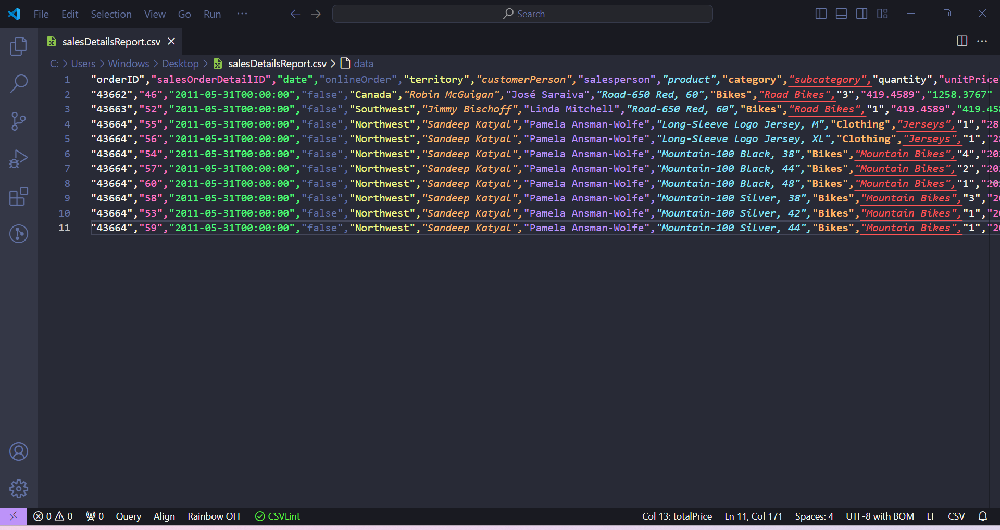

**Redis Cache Keys History**
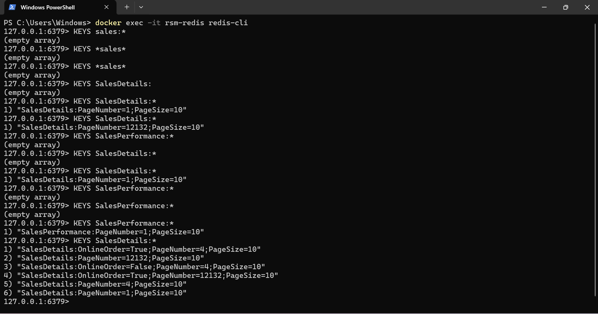

**Testing API - Swagger - 1**
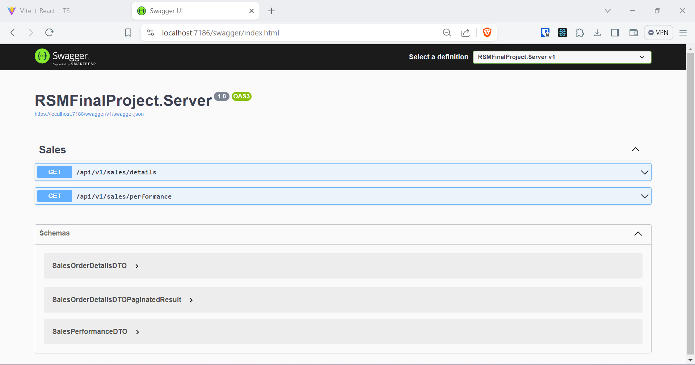

**Testing API - Swagger - 2**
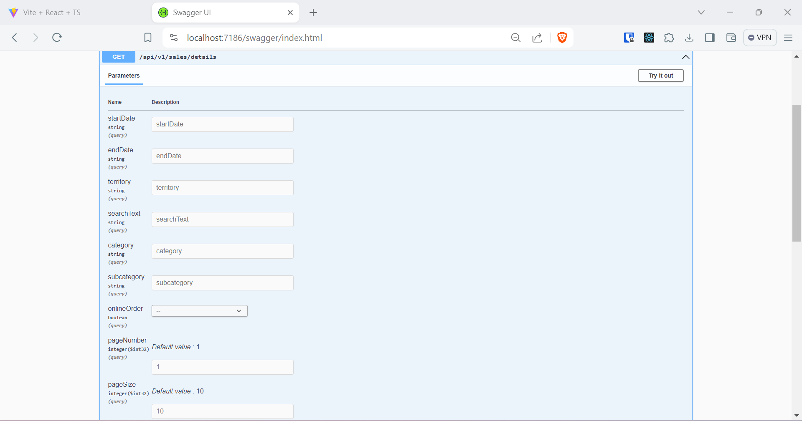

**Testing API - Swagger - 3**
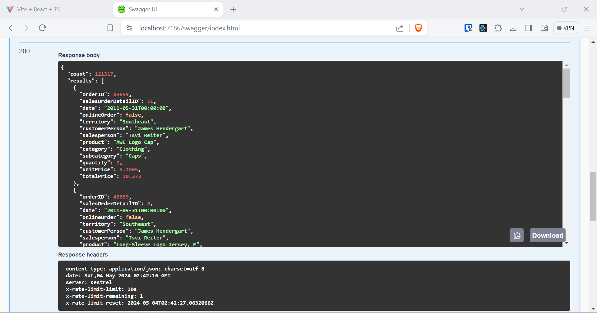

**Testing API - Swagger - 4**
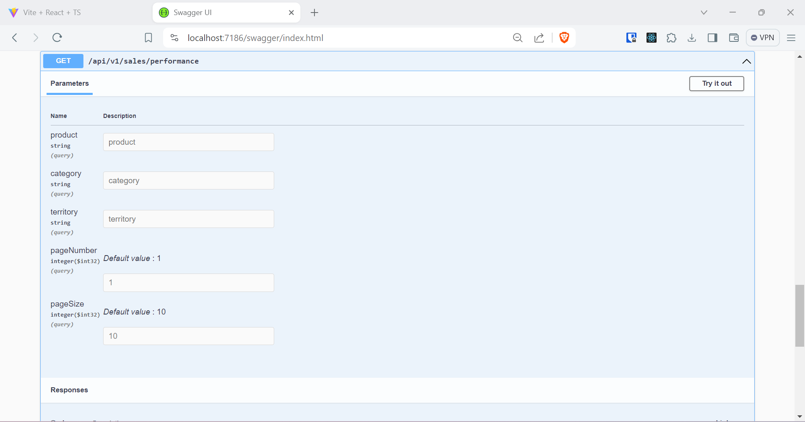

**Testing API - Swagger - 5**
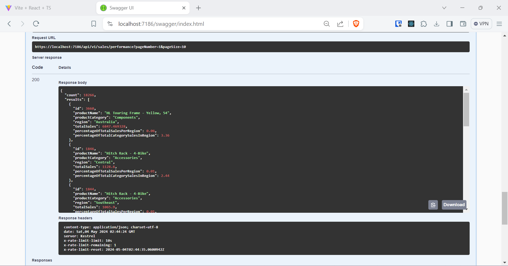
